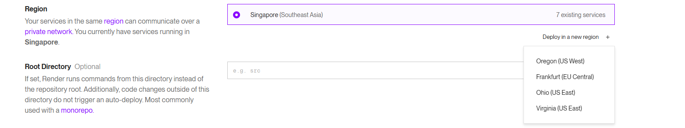
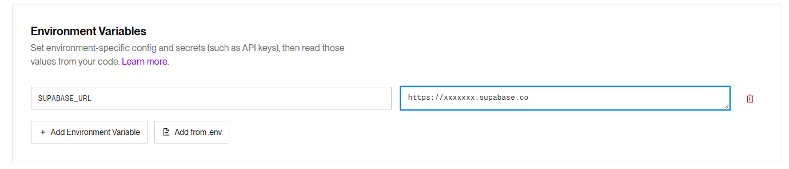

## Proxy to Supabase Cloud (Fastify)

Minimal Fastify reverse proxy that lets your app talk to Supabase through an alternate domain.

> [!NOTE]
> Experimental: intended as a quick workaround. Hardens nothing, just forwards traffic.

### What it does

Proxies only the standard Supabase service paths:
`/rest/v1`, `/auth/v1`, `/realtime/v1` (WebSocket), `/functions/v1`, `/storage/v1`

All headers (including your anon/service keys) pass through unchanged. No caching, no rate limiting, no key rotation.

### Quick Deploy (Render example)

1. Fork or clone this repo.
2. Create a new Web Service in Render (Node runtime).
3. Set the region near your Supabase project (Singapore if you're in UAE). See screenshot below.
4. Add the required env var `SUPABASE_URL` (the original Supabase project URL, e.g. `https://xyzcompany.supabase.co`).
5. Deploy. Render will assign you a new domain like `https://your-proxy.onrender.com`.
6. Point your client SDK to the proxy domain instead of the direct Supabase URL.

### Required env vars

| Name             | Required | Description                                                  |
| ---------------- | -------- | ------------------------------------------------------------ |
| `SUPABASE_URL`   | Yes      | Your original Supabase project base URL (no trailing slash). |
| `ENABLE_LOGGING` | No       | Set to `true` to enable Fastify logs.                        |

Render sets `PORT` automatically.

### Using with @supabase/supabase-js

```js
import { createClient } from "@supabase/supabase-js";

const supabase = createClient(
  "https://your-proxy.onrender.com", // proxy domain
  process.env.NEXT_PUBLIC_SUPABASE_ANON_KEY
);

const { data, error } = await supabase.from("todos").select("*");
```

### Before deploying – double check:

- Region choice (closest to users / Supabase region)

  

- `SUPABASE_URL` env variable is set

  

### WebSocket (Realtime)

`/realtime/v1` is registered with `websocket: true`, so Supabase realtime should function normally through the proxy.

### Limitations / Considerations

- Does not modify CORS; Fastify CORS is set to `origin: true` (reflect request origin). Adjust if you need stricter rules.
- Not a security boundary; treat it as a simple pipe.

### Optional Hardening Ideas (not included)

- Add an allowlist of origins
- Add request rate limiting / logging / metrics

### License

MIT
